# Adriana Heesh T1A2

Portfolio: https://adrianaheesh.netlify.app/

Ed Workspace: File too large for Ed

## Portfolio Description
### Purpose
The purpose of this portfolio is to demonstrate my skills as a full stack web developer in the making. I wanted my portfolio to be a good foundation that I could add to later as my collection of projects grows. I wanted it to feature content that was specific to my technical skills, as well as a space to show some personality because finding a good cultural fit is important to a lot of employers, and important to me. Finally, I wanted to be easy to contact, with a variety of touch points from email to social channels. 

### Functionality/Features
Keeping the purpose of the site in mind, I kept the design and colour scheme minimalistic, not only because this is more modern, but ensures the content stands out more. I featured stronger colours on links to create obvious call to actions for example the 'View my work' link on the homepage was the 'obvious' next action from my home page.

This was combined with a fixed navigation bar so the user could easily reach any part of the site no matter where they were, and a fixed footer so my social media accounts could be reached from any page too.

In addition, I wanted clear sectioning on pages with articles or posts (portfolio and blog pages) to clearly distinguish between content blocks and wanted to ensure these elements had interesting display across a variety of screens. To achieve this, a combination of Flexbox and Grid elements were used. 

I wanted to demonstrate at least one animation and pseudo class, but was careful to ensure they served a purpose. I chose a typewriting animation for my name on the homepage because it still looked clean and in-line with the other styling choices, and allowed the users eye to draw straight to my name, which is ideal when considering the target audience is potential employers and other developers. 

### Sitemap
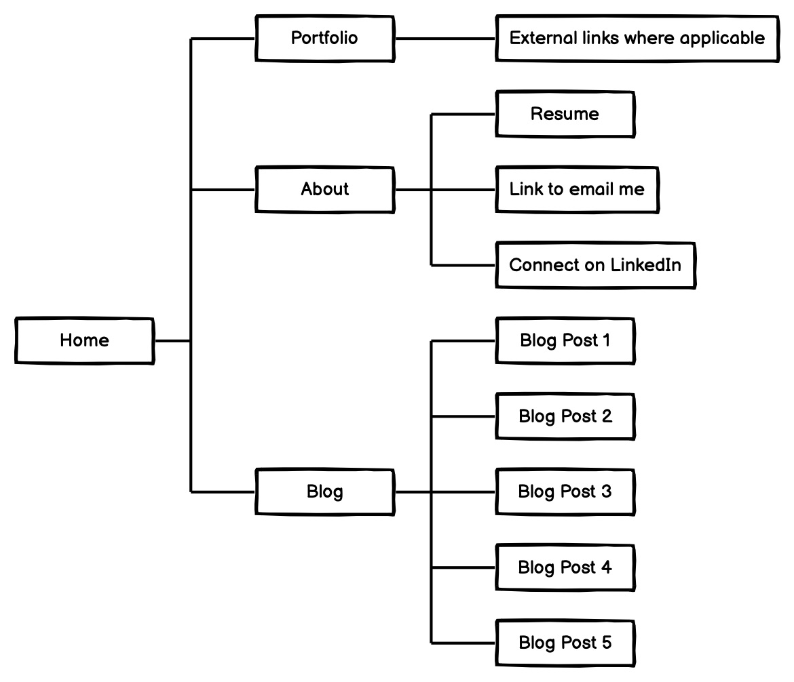 
The structure of the site is simple, keeping in line with the minimalistic theme.

### Screenshots
#### Desktop Images
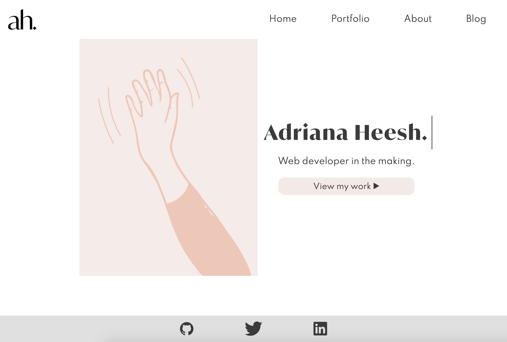
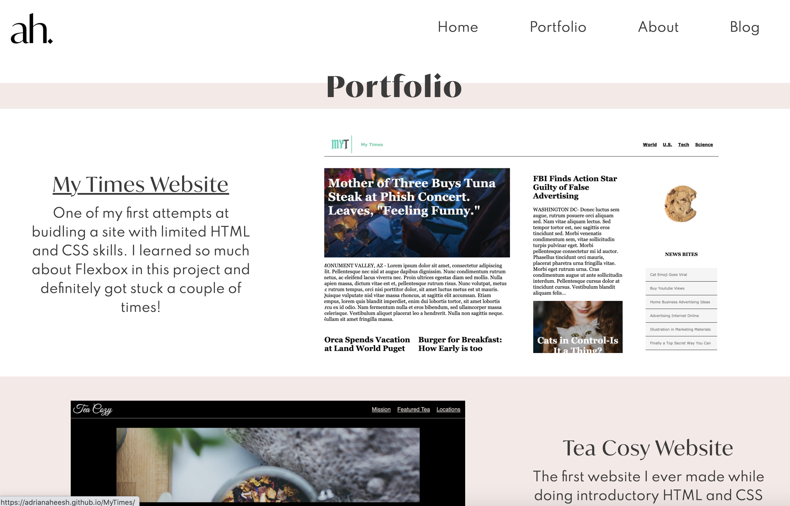
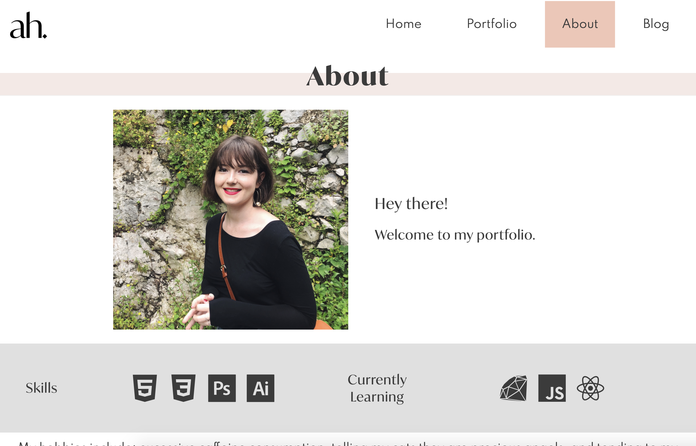
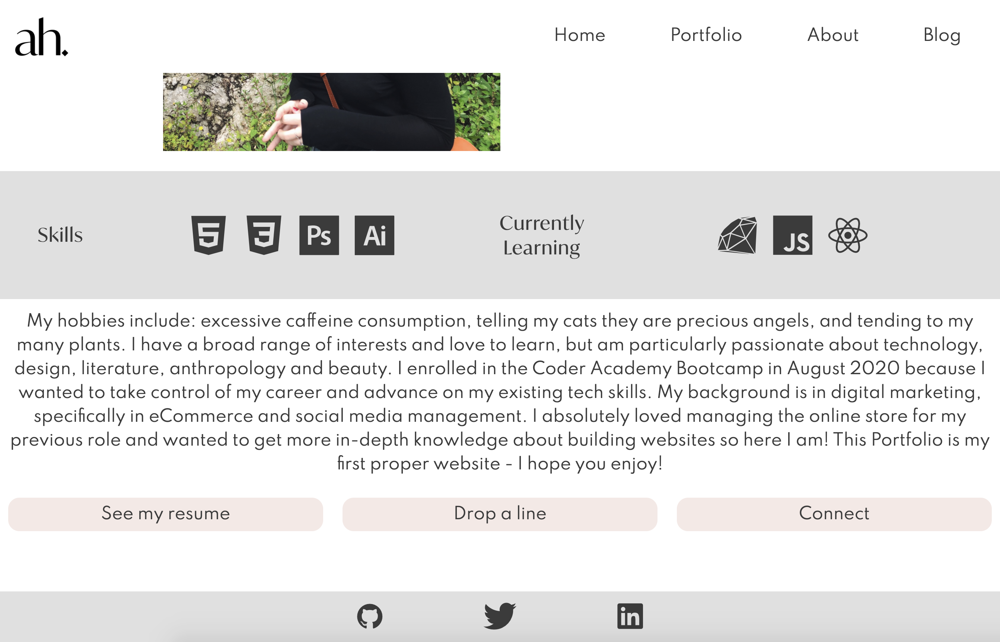
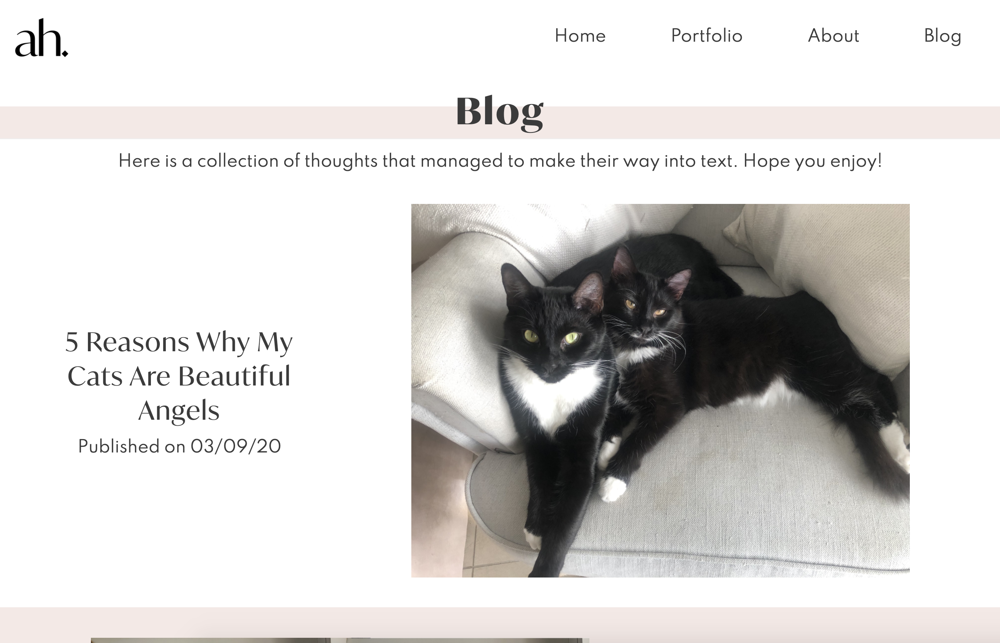
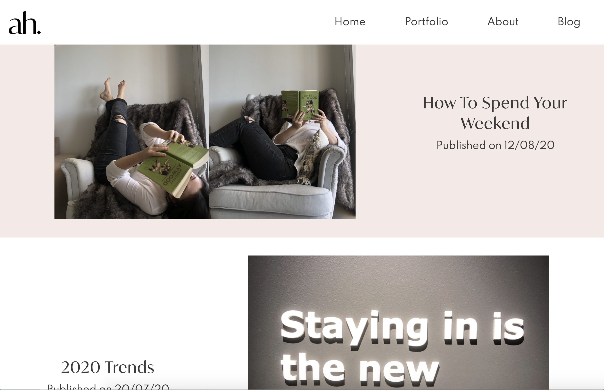
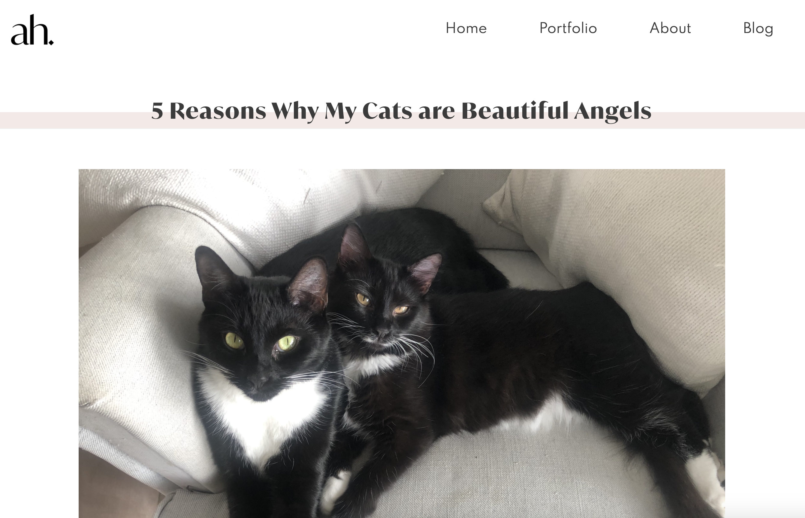
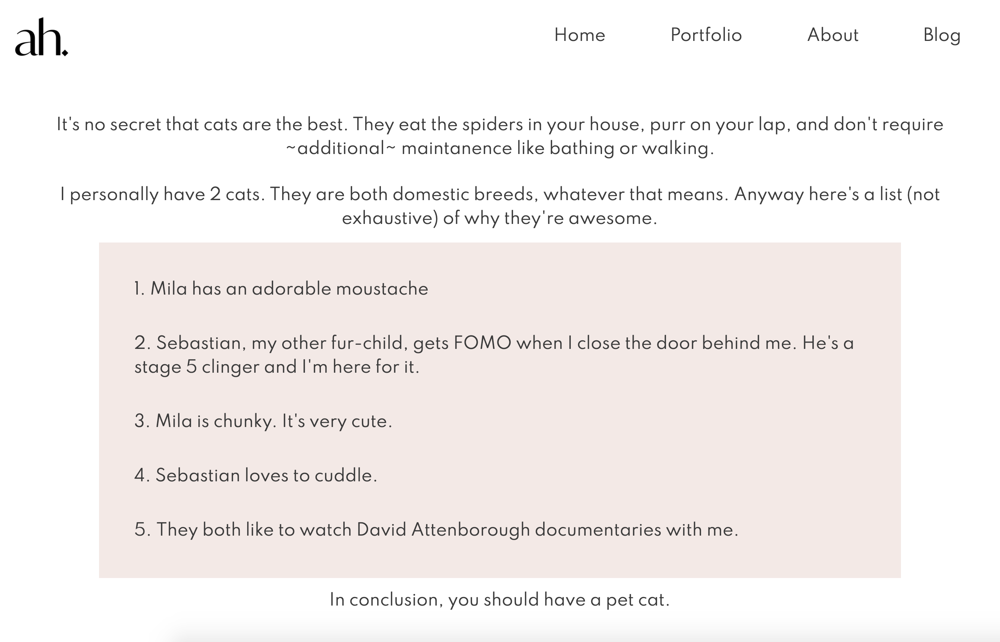

#### Mobile Images
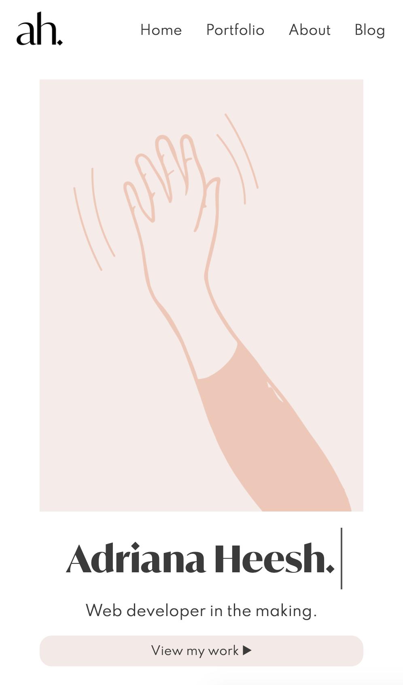
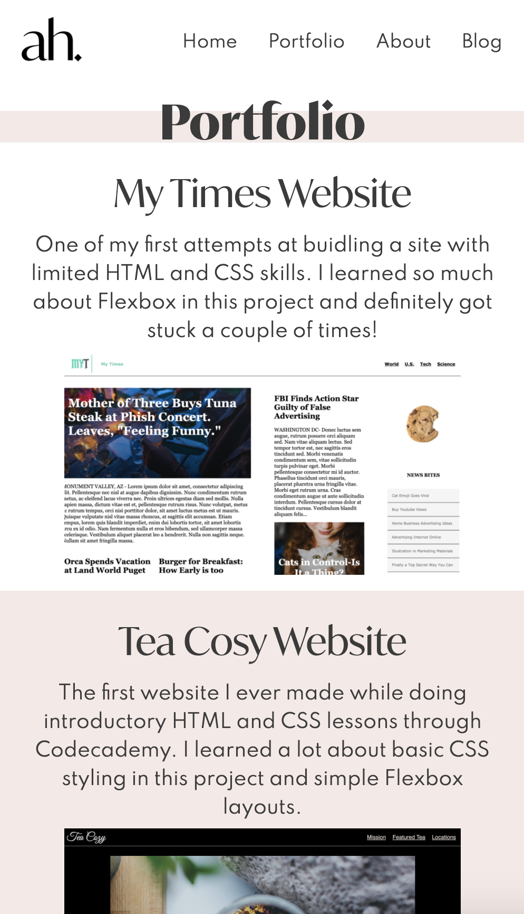
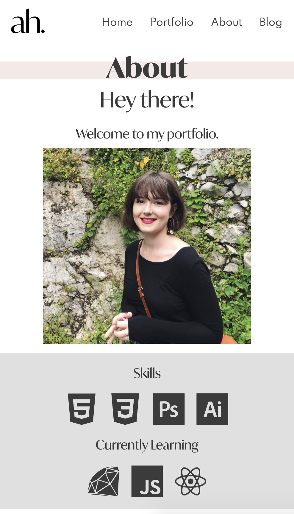
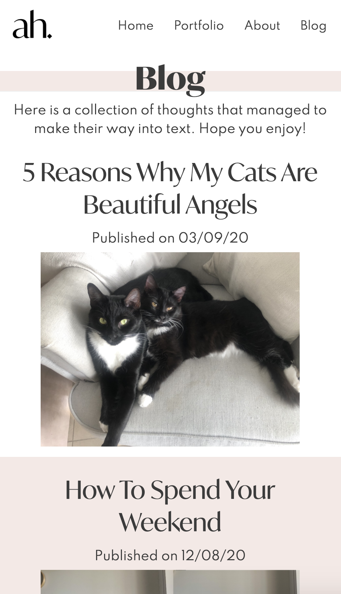
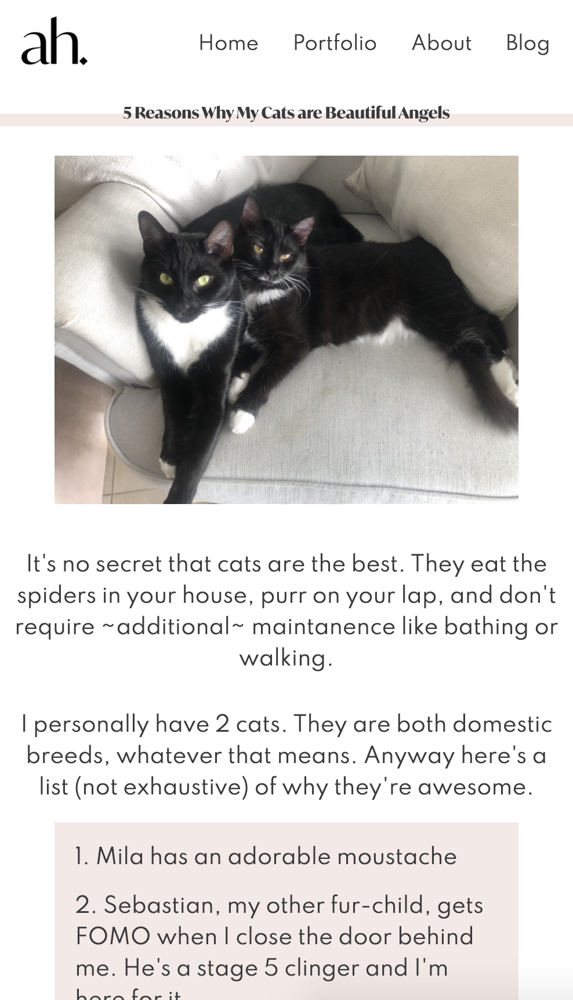

### Target Audience
The goal was always to keep potential employers in mind when building this site. For this reason, it was more important to be functional than anything else as ultimately I'm portraying myself as a competent developer. This influenced the amount of time and effort I spent into utilising Flexbox and Grid as they demonstrate a deeper understanding of how to build a responsive website, which is so important for modern users. As I learn more about the tech industry I will let this influence which of my skills are relevant or in-demand for future updates. I also want to ensure I can be reached in ways other than a direct email because sometimes the person looking might not think the individual is the right candidate, but are still interested in connecting on social channels which could lead to other connections in the future. This is why I opted to have social media buttons on the footer of every page. 

### Tech Stack
- HTML
- CSS
- Netlify
- Ed Workspace
- Visual Studio Code
- Terminal